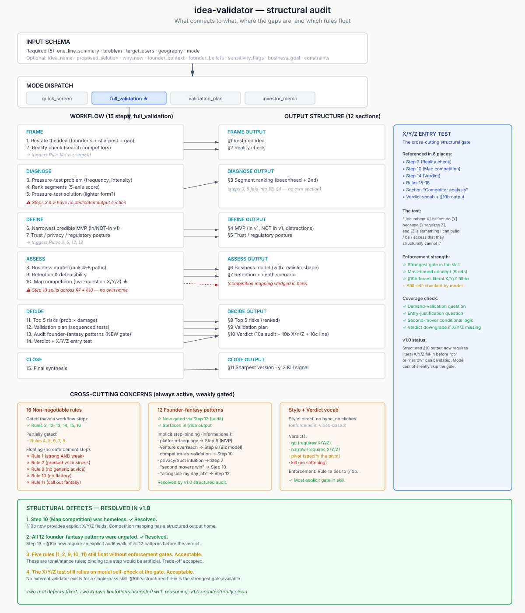

# idea-validator

A Claude skill for stress-testing startup, product, app, and feature ideas - without flattery, generic advice, or polite hedging.

## What it does

Takes an idea pitch and produces structured analysis covering problem reality, segment strength, MVP definition, business model viability, defensibility, top risks, and a concrete lean validation plan. Every analysis ends with a verdict, a sharpest-version paragraph, and an explicit kill signal.

It is built to distinguish:

- Useful product vs. good business
- Interesting feature vs. real wedge
- Polite interest vs. real demand
- Founder intuition vs. defensible thesis
- Niche utility vs. scalable company

## Why it exists

Most validation frameworks soften at the moment the founder needs hard news. This skill is deliberately built to do the opposite. It will tell you, plainly:

- When the product is good but the business is bad
- When you're treating an interesting feature as a wedge
- When "privacy-first" / "AI-powered" / "sustainability" is founder intuition, not a commercial differentiator
- When the category is saturated and your version is feature-equivalent to shipping competitors
- When the regulatory regime caps your scope
- When you should stop

## Modes

| Mode | Purpose | Length |
|---|---|---|
| `quick_screen` | Fast triage. Verdict + risks + kill signal. | ~700 words |
| `full_validation` | Complete analysis: problem, segment, MVP, business model, validation plan. | ~3000 words |
| `validation_plan` | Skip analysis; produce a concrete 30-day lean validation plan. | ~2000 words |
| `investor_memo` | Sober memo with anti-thesis, written as a third-party would. | ~2000 words |

## Installation

### Claude Code

Clone into your skills directory:

```bash
git clone https://github.com/<your-username>/idea-validator ~/.claude/skills/idea-validator
```

Or in a specific project:

```bash
git clone https://github.com/<your-username>/idea-validator .claude/skills/idea-validator
```

Skills are auto-loaded on the next session.

### Claude.ai

Package as a `.skill` file and upload through Settings → Capabilities → Skills:

```bash
python -m scripts.package_skill ./idea-validator
```

(Requires the Anthropic skill-creator tooling. See [Anthropic skills docs](https://docs.claude.com).)

## Usage

The skill triggers automatically on most idea-validation phrasings ("is this a good idea?", "validate this concept", "would this work as a business", or any substantive pitch).

For a structured invocation:

```
Use the idea-validator skill in full_validation mode.

idea_name: [working name]
one_line_summary: [the founder's own one-sentence pitch]
problem: [what pain exists, for whom]
proposed_solution: [what the product does]
target_users: [primary segment hypothesis]
geography: [launch market(s)]
why_now: [timing thesis - optional]
founder_context: [background, team, prior work - optional]
founder_beliefs: [stated convictions to be tested - optional]
sensitivity_flags: [health, finance, kids, privacy, AI, regulated industry, etc.]
business_goal: [lifestyle | bootstrapped | venture | acquisition | not_yet_decided]
constraints: [time available, capital, team size, day-job conflicts]
```

Required minimum: `one_line_summary`, `problem`, `target_users`, `geography`, `mode`. The skill will infer or ask for missing fields.

See `examples/` for a worked output.

## Principles

The skill enforces these rules in every response:

1. Skeptical by default. Optimism must be earned by evidence.
2. Always identify what is strong AND what is weak in the same response.
3. Always distinguish product logic from business logic; name the gap when they diverge.
4. Always define what is explicitly NOT in v1.
5. Always rank top assumptions by risk (probability × damage).
6. Always recommend the narrowest credible wedge, even if the founder wants a platform.
7. Always define a kill signal - concrete, observable, falsifiable.
8. Never assume venture-scale potential unless the unit economics support it.
9. Never give generic startup advice. Every recommendation must be specific to this idea.
10. Never flatter, congratulate, or use the word "exciting" about an idea.
11. **Always apply the two-question competitor test:** (1) does demand exist, (2) is the founder's entry justified. Never conflate them - competitors validate demand, not your entry. A "go" or "narrow" verdict requires the founder to name a specific structural advantage that incumbents cannot match.

Full ruleset in [`SKILL.md`](./SKILL.md).

## What this skill is not

- **Not a brainstorming tool.** It evaluates ideas; it doesn't generate them.
- **Not a pitch coach.** The output is for the founder, not for investors.
- **Not gentle.** If the idea is a feature-parity entry into a saturated category, the skill will say so in those words.
- **Not a substitute for actually doing the validation.** It designs the plan; you run it.

## Architecture



The skill's internal structure - workflow steps, output sections, rules, and cross-cutting concerns - is documented in the diagram above. It shows how the 15 workflow steps map to the 12 output sections, which rules are gated to specific steps versus floating, and where the two structural gates (founder-fantasy audit and X/Y/Z entry justification) sit in the verdict flow. A standalone HTML version with extra styling is at [`docs/architecture.html`](./docs/architecture.html).

The diagram is the result of auditing the skill against itself: before any analysis is published, the skill must walk an explicit founder-fantasy audit (§10a) and fill in the X/Y/Z entry justification (§10b) for any "go" or "narrow" verdict. These two gates exist because of structural defects surfaced by the audit.

## Tested

This skill has been used to evaluate several real ideas across consumer health, family/kids tech, and travel categories. In each case it converged on the same verdict the founder reached after weeks of independent thinking - usually in one pass and within ~10 minutes of reading.

The most useful evaluation metric: does the skill kill ideas you wanted it to validate? If it kills nothing, it's too soft. If it kills everything, it's broken. A roughly 1-in-3 survival rate across genuinely considered ideas is the target.

## Contributing

Open an issue with a concrete example where the skill softened, hedged, gave generic advice, or missed a competitor. Specific failures are more valuable than opinions. Pull requests welcome for: better triggering phrases, additional founder-fantasy patterns to catch, regulatory references for new jurisdictions.

## License

MIT - see [`LICENSE`](./LICENSE).
